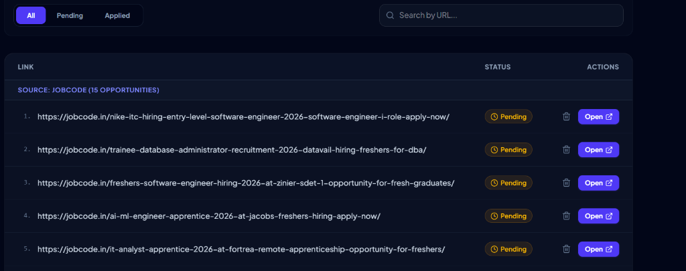

# Apply Tracker 🚀
### *Automated Off-Campus Job Opportunity Aggregator & Tracker*

Apply Tracker is a modern, high-performance web application designed to eliminate the friction of off-campus job hunting. By consolidating job openings from various disjointed web sources, YouTube recruitment channels, and Telegram placement groups, it gives job seekers a single, real-time dashboard of high-quality career opportunities.

---

## 📸 Visual Walkthrough

### 1. Daily Motivation Banner
Stay inspired during the job hunt with dynamic motivational quotes presented in a elegant glassmorphic bounding box with custom styling and gradients:


### 2. Live Opportunities Dashboard
Monitor job listings categorized by source. Filter by status (All, Pending, Applied), search by URL, clear listings, or trigger manual web scraping:



---

## ⚡ Core Features

- **Automated Web Scraping**: Scrapes official channels, fresher sites, YouTube placement creators, and Telegram placement groups.
- **Strictly Enforced Onboarding (Blocker)**: A modern, beautiful registration form matches Google Form styles. Users are blocked from accessing the system or using scraping features until registration is completed.
- **Dual Google Form Integration**:
  1. **Registration Form**: Prefills and submits student details (Name, College, Degree, YOP, Tech Stack) directly to a Google Form backend.
  2. **Automated Feedback & Ratings**: Automatically monitors applications. Once a user marks 20+ opportunities as applied, a feedback card rating widget appears. Submitting ratings and comments posts silently to a feedback Google Form in the background (no manual mail client popup).
- **Automatic Email Tagging**: The system automatically prefixes comments with the user's registered email (`[User: student@email.com] Comment...`), giving you clear analytics on who provided the feedback without cluttering the Form questions.
- **Generic Google Form Parser**: A CLI utility script (`node backend/parse_form.js`) that takes any public Google Form URL and extracts all entry input IDs automatically.
- **Premium Dark-Mode UI**: Built with Tailwind CSS, custom glassmorphism panels, and the highly readable **Plus Jakarta Sans** font.

---

## 💼 Career & Productivity Impact

For students and job seekers, off-campus hiring is highly competitive and fragmented. Apply Tracker creates immediate, measurable value:

1. **Saves 10+ Hours/Week**: Replaces manual checking of dozens of Telegram groups, YouTube videos, and placement blogs with a single click.
2. **First-Mover Advantage**: Spots new opportunities within a 24 to 72-hour window, drastically increasing application success rates before portals close.
3. **Organized Progress Tracking**: Tracks opportunities through a clear lifecycle (Pending ➔ Applied). Auto-marking marks links as applied the moment they are opened, eliminating repetitive checks.
4. **Data-Driven Placement Insights**: For administrators, the Google Form integration aggregates critical analytics (which tech stacks, branches, and colleges are most active) to align training and resources.

---

## 🛠️ Technology Stack

**Frontend:**
- **React 18** with **TypeScript**
- **Vite** (Next-generation front-end tooling)
- **Tailwind CSS** (Premium glassmorphic UI design)
- **Lucide React** (Modern, clean iconography)

**Backend:**
- **Node.js** & **Express**
- **Axios** (Stateless request handling)
- **Cheerio** (High-speed HTML parsing and scraping engine)

---

## 🚀 Getting Started

### Prerequisites
- Node.js (v18 or higher)
- npm (v9 or higher)

### 1. Installation
Install dependencies for all components (Monorepo, frontend, and backend) simultaneously:
```bash
npm run install:all
```

### 2. Configure Environment Variables
Create a `.env` file inside the `frontend/` directory.

```env
# User Onboarding Form Config
VITE_GOOGLE_FORM_URL=https://docs.google.com/forms/d/e/YOUR_FORM_ID/formResponse
VITE_GOOGLE_FORM_NAME_ENTRY=entry.1713974610
VITE_GOOGLE_FORM_EMAIL_ENTRY=entry.967371037
VITE_GOOGLE_FORM_COLLEGE_ENTRY=entry.376953620
VITE_GOOGLE_FORM_DEGREE_ENTRY=entry.1505402862
VITE_GOOGLE_FORM_BRANCH_ENTRY=entry.692543096
VITE_GOOGLE_FORM_YOP_ENTRY=entry.137863666
VITE_GOOGLE_FORM_TECHSTACK_ENTRY=entry.1996115967
VITE_GOOGLE_FORM_DISCOVERY_ENTRY=entry.1540765479
VITE_GOOGLE_FORM_CONFIRMATION_ENTRY=entry.690298539

# Feedback Form Config
VITE_GOOGLE_FORM_FEEDBACK_URL=https://docs.google.com/forms/d/e/YOUR_FEEDBACK_FORM_ID/formResponse
VITE_GOOGLE_FORM_FEEDBACK_RATING_ENTRY=entry.1184290205
VITE_GOOGLE_FORM_FEEDBACK_COMMENT_ENTRY=entry.1997358354

# Supabase URL Translation Config (Backend Server Env Vars)
SUPABASE_URL=https://your-project-id.supabase.co
SUPABASE_KEY=your-supabase-anon-or-service-role-key
SUPABASE_TABLE_NAME=links
```
*(Note: If Google Form environment variables are omitted, the application will default to built-in fallbacks matching your default Google Forms, making it fully functional out-of-the-box. If Supabase variables are omitted, the scraper will simply return the original source URLs without mapping translation.)*

### 3. Run Locally in Development
Start both backend API server and frontend Vite development server in parallel:
```bash
npm run dev
```
Open [http://localhost:5173](http://localhost:5173) in your browser.

### 4. Build for Production
To bundle the frontend for production deployment:
```bash
npm run build
```

---

## 🛠️ Google Form Utility Parser

If you update your Google Forms and need to extract new entry IDs quickly without inspecting HTML codes, run the generic utility script:

```bash
# General Syntax:
node backend/parse_form.js "<PUBLIC_GOOGLE_FORM_VIEW_URL>"

# Example:
node backend/parse_form.js "https://docs.google.com/forms/d/e/1FAIpQLSdvz2KEy3zEsLw9RnTYbN1ShBuP6UgzQQ_QzaEQpx0a5mRwIw/viewform"
```

The script fetches the form structure, parses the field keys, prints the entry IDs directly to your terminal, and writes them to your `.env` file if it matches the onboarding form.

---
*Made with ❤️ by Mohammad*
